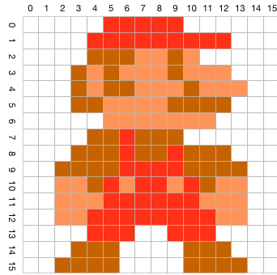

# Übungen

#### Aufgabe 1
Lässt sich die Zahl π als Nachricht übermitteln?

#### Aufgabe 2
Schätzungen zufolge besteht das Universum aus einer Tredezillion Atomen (10^78). Welche Bitbreite ist mindestens notwendig, um diese Zahl im Rechner zu speichern?

#### Aufgabe 3
Vervollständigen Sie die leeren Felder:

| Dezimal | Binär    | Oktal | Hexadezimal |
|---------|----------|-------|-------------|
| 198     |          |       |             |
|         | 10101101 |       |             |
|         |          |  535  |             |
|         |          |       | 4AC         |

#### Aufgabe 4:
Vervollständigen Sie die leeren Felder:

| Dezimal | Binär    | Oktal | Hexadezimal |
|---------|----------|-------|-------------|
| 521,125 |          |       |             |
|         | 1011,11  |       |             |
|         |          |  15,7 |             |
|         |          |       | AC,8        |

#### Aufgabe 5:
Während der Fehlersuche stoßen Sie auf das folgende Speicherabbild:

`C0 98 00 00 00 00 00 00`

Welche Werte werden dargestellt, wenn Sie die Werte

1. als zwei IEEE-Gleitkommazahlen einfacher Genauigkeit bzw.
2. als eine IEEE-Gleitkommazahl doppelter Genauigkeit interpretieren?

Nehmen Sie für Ihre Betrachtung an, dass die Bytes in natürlicher Reihenfolge im Speicher abgelegt sind (Big-Endian-Format).

#### Augabe 6:
Führen Sie die folgenden binären Rechenoperationen durch

  * `110101 + 11001 =`
  * `111011 − 10111 =`
  * `11011 * 1011 =`
  * `101000010 : 1110 =`

  * `101,1101 + 1110,11 =`
  * `111011 + 11101 =`
  * `110,1001 − 101,11011 =`
  * `110001 − 1101101 =`

#### Aufgabe 7
Überlegen Sie sich ein Schema, wie das folgende Bild in Bits umgewandelt werden kann. Versuchen Sie die Daten so kompakt wie möglich abzulegen.

Codieren Sie die erste und die letzte Zeile nach Ihrem Schema und geben Sie das Ergebnis an. Gruppieren Sie dabei die Bits in Bytes.
